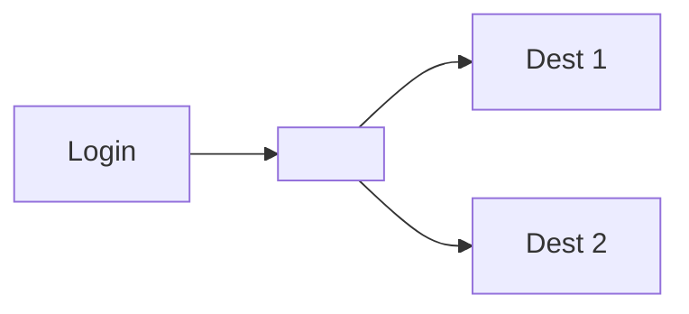
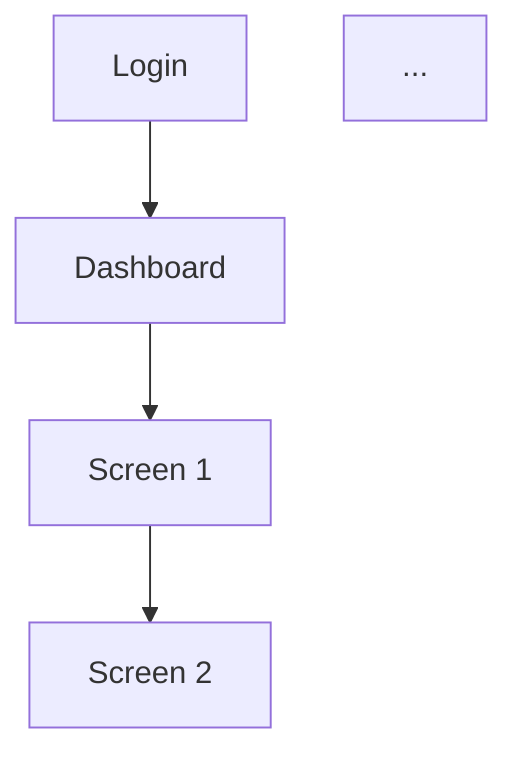

# Layout + Screen Flow + FE Doc Skill

Design layout specifications and screen navigation flows, then output them as structured documentation for frontend developers.

## When to Use

- **CLI:** `/haki:layout [screen-name]` or `@haki:layout` in any conversation
- **Auto:** After brainstorming completes with UI/screen decisions — suggest: *"Có muốn tạo layout doc cho FE dev không?"*
- **Manual:** User explicitly asks for layout, wireframe, or screen flow documentation

## Workflow

### Step 1: Context Gathering

Ask 2-3 questions about the screen:

1. **Purpose:** What does this screen do? Who uses it?
2. **Auth:** Required or none? Role-based differences?
3. **Data:** What data sources/entities are displayed?

### Step 2: Wireframe with Visual Companion

Use Visual Companion (browser-based HTML mockups) if user accepted it:

1. Start server: `bash scripts/start-server.sh --project-dir <project-root>`
2. Draw layout using HTML fragment classes:
   - `.mock-nav` — navigation bar
   - `.mock-sidebar` — sidebar panel
   - `.mock-content` — main content area
   - `.mock-button`, `.mock-input`, `.mock-card` — form elements
   - `.mockup` — container for full mockups

3. Ask user to review and iterate until approved

### Step 3: Navigation Flow

Document entry/exit points:
- Where does user enter this screen?
- Where can user go from here?
- Any modal/dialog entry points?
- State transitions?

Output as Mermaid flowchart in the doc.

### Step 4: Design Tokens (from ui-ux-pro-max)

Lookup design tokens using ui-ux-pro-max search:

```bash
python skills/ui-ux-pro-max/search.py --domain spacing
python skills/ui-ux-pro-max/search.py --domain typography
python skills/ui-ux-pro-max/search.py --domain color
```

Record in `## Design Tokens` section.

### Step 5: Component Inventory

For each main component on the screen:

| Component | Props | States |
|---|---|---|
| Button | label, variant, disabled | default, hover, active, disabled, loading |
| Card | title, content, actions | default, hover, selected, empty |
| Form | fields, onSubmit, validation | idle, submitting, error, success |
| Table | columns, data, actions | loading, empty, error, paginated |
| Modal | title, content, actions | open, closing |
| Sidebar | items, collapsed | expanded, collapsed |

### Step 6: Output — Write Doc

**Per-screen doc:** `.haki/screens/<screen-name>.md`

**Main layout doc:** `.haki/layouts/<app>-screen-flow.md`

If main layout doc doesn't exist, create it with:
- Full app navigation flowchart (Mermaid)
- Global layout zones
- Design tokens
- Screen index table

### Step 7: Delta Report

1. **Pre-update snapshot:** `git add .haki/ -m "brain: pre-update snapshot"`
2. **Verify files written:** Check both screen doc and main layout doc
3. **Update ROADMAP.md:** Add link under Knowledge Base
4. **Commit:** `git add .haki/ && git commit -m "feat: add layout — <screen-name>"`
5. **Notify user:**

> "Đã ghi layout vào `.haki/`: [.haki/screens/<name>.md](.haki/screens/<name>.md) + [.haki/layouts/<app>-screen-flow.md](.haki/layouts/<app>-screen-flow.md). Rollback: `git reset HEAD~1`"

## Document Templates

### Per-Screen Doc

```markdown
# <Screen Name>

> Status: Draft | Reviewed | Approved

## Metadata

**Purpose:** ...
**Auth:** Required | None
**User Role:** ...
**Data Sources:** ...

## Wireframe

<!-- ASCII art layout -->
+--[ Header ]------------------+
| Logo | Nav | User Menu        |
+--[ Sidebar ]--+--[ Main ]---+
| Menu Items    | Content      |
|               |              |
+---------------+--------------+
| Footer                       |
+------------------------------+

## Layout Grid

| Zone | Size | Responsive |
|---|---|---|
| Header | 56px | Mobile: 48px |
| Sidebar | 240px | Collapsed on mobile |
| Main | flex-1 | Full width |

## Navigation



**Entry points:** ...
**Exit points:** ...
**Modals:** ...

## Component Inventory

| Component | Props | States |
|---|---|---|
| ... | ... | ... |

## Design Tokens

| Token | Value |
|---|---|
| Spacing unit | 4px |
| Border radius | 8px |
| Breakpoints | 768px, 1024px, 1280px |

## Responsive Behavior

| Breakpoint | Layout |
|---|---|
| Mobile (<768px) | Sidebar collapsed, single column |
| Tablet (768-1024px) | Sidebar collapsed, 2-column |
| Desktop (>1024px) | Full layout |

## Open Questions

- ...
```

### Main Layout Doc

```markdown
# <App Name> — Screen Flow & Layout Spec

> Last updated: YYYY-MM-DD

## Navigation Flow



## Layout Zones (Global)

| Zone | Grid Area | Description |
|---|---|---|
| Header | grid-area: header | App bar, navigation |
| Sidebar | grid-area: sidebar | Main navigation menu |
| Main | grid-area: main | Content area |
| Footer | grid-area: footer | Secondary info |

## Design Tokens

| Token | Value |
|---|---|
| ... | ... |

## Screen Index

| Screen | Doc | Auth | Status |
|---|---|---|---|
| Login | [screens/login.md](./screens/login.md) | None | ✅ |
| Dashboard | [screens/dashboard.md](./screens/dashboard.md) | Required | ⏳ |
```

## Integration Points

| Skill | Integration |
|---|---|
| `brainstorming` | Auto-trigger suggestion after UI brainstorming |
| `ui-ux-pro-max` | Design token lookup (spacing, typography, colors) |
| `user-docs-generator` | Share output format and asset location |

## Rollback

```bash
git reset HEAD~1
```
Files remain on disk but unstaged — review and re-commit or discard.